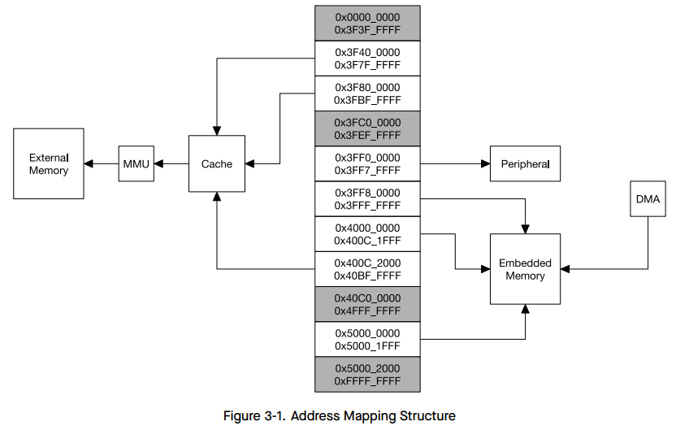
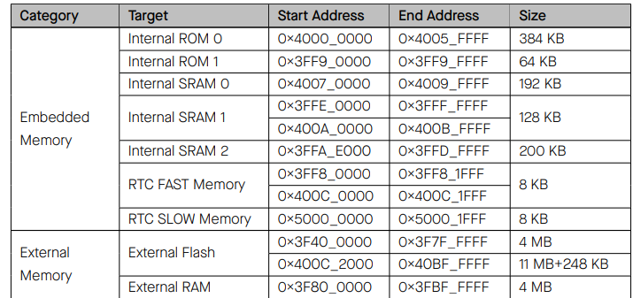
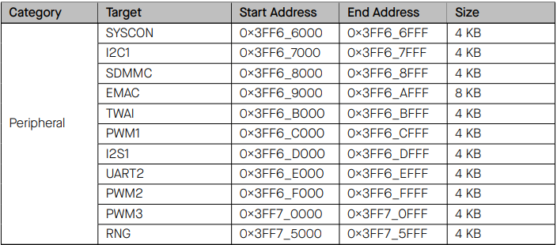
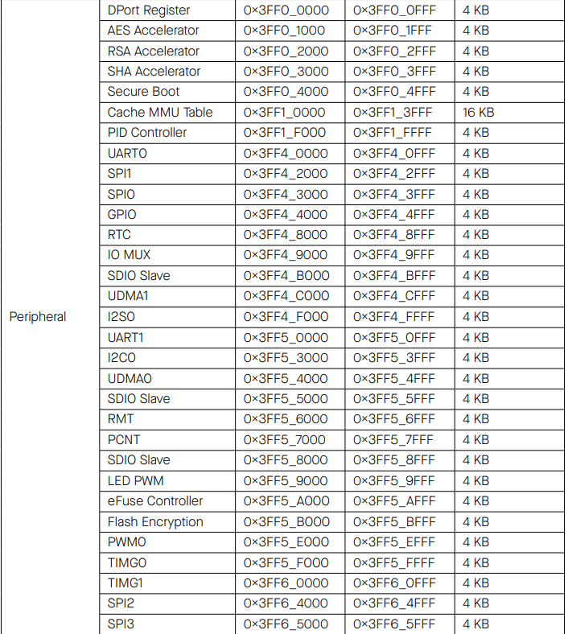

# Actividad 1

## 1. Investigar 
### 1.1. CPU
[Central processing unit](https://en.wikipedia.org/wiki/Central_processing_unit)

is the most important processor in a given computer.Its electronic circuitry executes instructions of a computer program, such as arithmetic, logic, controlling, and input/output (I/O) operations.

[What is a central processing unit (CPU)?](https://www.ibm.com/think/topics/central-processing-unit)

central processing unit (CPU) is the primary functional component of a computer. The CPU is an assemblage of electronic circuitry that run a computer’s operating system and apps and manage a variety of other computer operations. A CPU is, essentially, the active brain of the computer. The CPU is the invisible manager inside the computer where data input is transformed into information output. It stores and executes program instructions through its vast networks of circuitry.

### 1.2. ALU
[What are the components in a CPU?](https://www.ibm.com/think/topics/central-processing-unit)

The arithmetic/logic unit (ALU) handles all arithmetic operations and logical operations. Its math functionality is based on four types of operations (addition, subtraction, multiplication and division). Logical operations typically involve some type of comparison (such as of letters, numbers or special characters) that’s tied to a particular computer action.

### 1.3. Registros
[Registros: tomado de chatGPT](https://chatgpt.com/)

Los registros son elementos de almacenamiento de datos dentro de un procesador o una unidad de procesamiento central (CPU). Pueden clasificarse en dos categorías principales:

Registros de propósito general:

Estos registros se utilizan para almacenar datos temporales y resultados de operaciones dentro del CPU. Son accesibles para el programa en ejecución y se utilizan para una variedad de propósitos, como almacenar operandos para operaciones aritméticas y lógicas, guardar resultados intermedios, y realizar transferencias de datos entre diferentes partes del sistema.

Registros específicos:
Este grupo incluye registros que desempeñan funciones específicas y críticas dentro del funcionamiento del procesador. Algunos ejemplos comunes son:

* Program Counter (PC): Es un registro que contiene la dirección de la siguiente instrucción a ejecutar por la CPU. Indica la posición en la memoria de la siguiente instrucción a ejecutar secuencialmente.

* Stack Pointer (SP): Este registro apunta al tope de la pila en la memoria. La pila se utiliza para gestionar datos temporalmente, como la información de retorno de funciones y variables locales.

* Registro de Estado (o Flags): Contiene bits que indican el estado actual de la CPU después de la ejecución de una operación. Por ejemplo, puede indicar si una operación resultó en un valor cero, negativo o si hubo un desbordamiento.

* Registro de Datos (o Accumulator): En algunos diseños de CPU, el registro de datos principal o acumulador se utiliza para operaciones aritméticas y lógicas específicas.

Estos registros específicos son esenciales para el control del flujo de ejecución, la gestión de datos y la ejecución de instrucciones dentro de la CPU, asegurando que las operaciones se realicen de manera eficiente y ordenada.

### 1.4. Unidad de control 
[Guiding concepts: Data storage and memory](https://www.ibm.com/think/topics/central-processing-unit)

The control unit of the CPU houses circuitry that guides the computer system through a system of electrical pulses and notifies it to execute high-level computer instructions. But despite its name, the control unit itself doesn’t control individual apps or programs; instead, it assigns those tasks as a human manager assigns particular jobs to different workers.

### 1.5. Buses de datos y de dirección 

[Bus de Datos y de Dirección: tomado de chatGPT](https://chatgpt.com/)

En computación, especialmente en el contexto de los sistemas de hardware y arquitectura de computadoras, los buses de datos y de dirección son componentes fundamentales que facilitan la comunicación y el intercambio de información entre diferentes partes del sistema.

Bus de Datos: 

El bus de datos es un conjunto de cables o líneas que permiten la transferencia de datos entre diversos componentes de un sistema informático. Estos componentes pueden incluir la CPU, la memoria RAM, dispositivos de entrada/salida (como discos duros, tarjetas gráficas, etc.), y otros dispositivos periféricos.
La función principal del bus de datos es transportar información binaria (bits) que representan datos entre los diferentes componentes del sistema. Por ejemplo, cuando la CPU necesita leer o escribir datos en la memoria RAM, utiliza el bus de datos para transmitir la información.
La anchura del bus de datos (medida en bits) determina la cantidad de datos que se pueden transferir simultáneamente. Por ejemplo, un bus de datos de 64 bits puede transferir 64 bits de datos en una sola operación.

Bus de Dirección:

El bus de dirección es otro conjunto de cables o líneas que se utilizan para especificar la dirección física de la memoria o de los dispositivos periféricos a los que se desea acceder desde la CPU.
A diferencia del bus de datos que transfiere los datos en sí, el bus de dirección transfiere direcciones (números binarios) que indican la ubicación específica de memoria o de dispositivos periféricos.
La cantidad de líneas del bus de dirección determina la cantidad de direcciones únicas que se pueden especificar. Por ejemplo, un bus de dirección de 32 bits puede direccionar hasta 2^32 (4.294.967.296) ubicaciones de memoria diferentes.

En resumen, mientras que el bus de datos se encarga de transferir los datos entre los componentes del sistema, el bus de dirección se utiliza para especificar la ubicación específica de memoria o de dispositivos a los que se desea acceder. Ambos buses son esenciales para el funcionamiento adecuado y eficiente de un sistema informático, permitiendo la comunicación y la gestión de datos de manera coordinada y rápida.

### 1.6. Memoria
[Guiding concepts: Data storage and memory](https://www.ibm.com/think/topics/central-processing-unit)

Memory is an allocation of computer files from which specific operating instructions or other forms of digital information can be extracted and utilized. Memory usually takes the form of short-term storage for the files most often accessed during recent computer use. When a piece of data first enters an operating system (OS), it’s placed within that OS’s random-access memory (RAM).

### 1.7. Opcode 
[Opcode: tomado de chatGPT](https://chatgpt.com/)

En informática, un código de operación u opcode (acrónimo inglés de operation code) es la porción de una instrucción de lenguaje de máquina que especifica la operación a ser realizada. Su especificación y formato serán determinados por la arquitectura del conjunto de instrucciones (ISA) del componente de hardware de computador - normalmente un CPU, pero posiblemente una unidad más especializada.

## 2. Descripción

En este modelo de computadora, encontramos 3 bloques principales: dos de memoria, separados, el ROM y la memoria; y la CPU. Además, se puede evidenciar, una señal de reloj con la frecuencia del procesador. 

Dentro de la memoria ROM, en la cual se almacena el programa, podemos encontrar dos registros: el registro A, encarcado de mostrarnos la dirección donde se tiene que buscar la instrucción; y el registro D, encargado de recuperar el dato de la instrucción. 

Por otro lado, la otra memoria, guarda los datos con los que se va operar. 

La CPU, es el cerebro del computador, y es el encargado de encontrar la instrucción y desarrollarla. 

## 4. Fetch, Decode, Execute

Fetch: va y busca la instrucción , en la dirección que le mande el pc

Decode: decodifica, es decir, ve que tipo de operacion tiene que realizar, ¿es tipo A o tipo C? y le manda los bits a las compuertas correspondientes para luego ser ejecutadas. 

execute: ejecuta la orden

## 5 y 6. Instrucciones tipo A y C
Instrucciones tipo A: Estas instrucciones SIEMPRE hacen lo mismo: almacenan en el circuito de la CPU los 15 bits menos significativos de la instrucción. ¿En dónde se almacenan esos bits?, en una memoria interna de la CPU llamada REGISTRO A.

Instrucciones tipo C: son instrucciones cuyo bit de mayor peso es 1.
Con este tipo de instrucciones se pueden realizar 3 cosas: operaciones, indicar un destino, y saltos.

En general una instrucción tipo C se representa en lenguaje ensamblador así:`destino=operación;salto`
las instrucciones tipo C codifican MUCHAS funciones. Cada uno de los 16 bits de la instrucción tipo C sirve para indicar qué debe hacer la CPU. 
las operaciones son muy variadas, desde invertir los bits del registro D y A, hasta realizar operaciones como D+, A-1, etc. 

## 7. Compuertas lógicas de la CPU

los tres primers bits determinan si es una instrucción tipo A o tipo C, si es tipo A, su dígito más significativo empieza por 0, y si es tipo C, la instrucción empieza en 111. Por lo tanto se utiliza una compuerta lógica negadora NOT, para verificar este dígito más significativo. ¿Es tipo A? entonces pasa a ser un 1 ya se sabe que es tipo A y se acaba la operación. Con los otros 2 dígitos más significativos se hace un sistema de dos compuertas AND, que verifican si son 1 o 0; si efectivamente, son 1, y el dígito más significativo también lo es, entonces se sabe que es una instrucción tipo C. 

## 9. Programa en Assembler

Básicamente la función de este código en Assembler, es crear un contador, sirviéndose de los registros A y D. cuando tiene el símbolo @ quiere decir que se está actuando con el registro A. Mientras que cuando el código nos muestra "D =", evidentemente, está actuando para el registro D. El contador de nuestro programa será "i", que será constantemente guardado dentro de un sumador "sum", que a su vez, no puede ser mayor a 100. Siempre que esto se cumple, se va guardando "i" en "sum ", y vuelve iniciar un ciclo gracias al salto JMP. Cuando por fin sum es mayor a 100 se detiene el programa. 

los valores se van guardando en la memoria RAM, mientras que las instrucciones del programa están guardadas en la memoria ROM. El registro pc es el encargado de recorrer cada una de las ubicaciones donde están las instrucciones. Por ejemplo: pc = 2, nos muestra una ubicación en la ROM y la participación del registro pc en esta. 

# Actividad 2 

## 1.
## 2. Procesador ESP32
[esp32_datasheet_en.pdf](https://www.espressif.com/sites/default/files/documentation/esp32_datasheet_en.pdf)

Tipo de Arquitectura:

* **Arquitectura**: La arquitectura del ESP32 es una variante de la arquitectura Harvard, ya que tiene buses separados para instrucciones y datos, pero permite que el procesador acceda a la memoria de datos desde el espacio de direcciones de instrucciones y viceversa, lo que añade flexibilidad.

* **Procesador y Núcleos**: El ESP32 cuenta con procesadores Xtensa® single-/dual-core 32-bit LX6 microprocessor(s) y 3 nucleos: 1 nucleo a 1 a 240 MHz: 504.85 CoreMark; 2.10 CoreMark/MHz. Y dos núcleos a 240 MHz: 994.26 CoreMark; 4.14 CoreMark/MHz

* **Memoria**: El ESP32 tiene un mapa de memoria dividido en varias regiones para instrucciones y datos. Posee una memoria ROM de 448 KB, una SRAM de 520 KB y 16 kB  SRAM en RTC. 

Para mostrar mejor las direcciones que corresponden a cada segmento de memoria, me valdré de una tabla presentada en el datasheet del ESP32: 

Para los perifércos: 

* ***Clocks* y *Timers***: además cuenta con los siguientes *clocks* y *timers*: 

    • Internal 8 MHz oscillator with calibration
    • Internal RC oscillator with calibration
    • External 2 MHz ~ 60 MHz crystal oscillator (40 MHz only for Wi-Fi/Bluetooth functionality)
    • External 32 kHz crystal oscillator for RTC with calibration
    • Two timer groups, including 2 × 64-bit timers and 1 × main watchdog in each group
    • One RTC timer
    • RTC watchdog

## 3. Comparación de microprocesadores

Los microprocesadores utilizados serán: 

Intel Core i9-11900K (x86-64)
AMD Ryzen 9 5900X
Apple M1

Las instrucciones que compararemos son:

ADD (suma)
MUL (multiplicación)
MOV (carga de datos desde memoria)

Y los parámetros que compararemos son: 

Longitud
Ciclos de reloj 
Complejidad 

Para **ADD**: 

|--------------------------------|----------------------------|--------------------------------|------------------------------|
| **Procesadores**               | **Longitud**               | **Ciclos de Reloj**            | **Complejidad**              |
|--------------------------------|----------------------------|--------------------------------|------------------------------|
| Intel Core i9-11900K (x86-64)  | 1-4 bytes                  | 1 ciclo                        | Baja                         |
| AMD Ryzen 9 5900X              | 1-4 bytes                  | 1 ciclo (mejor de los casos)   | Baja                         |
| Apple M1                       | 4 bytes (RISC)             | 1 ciclo (mejor de los casos)   | Baja                         |
|--------------------------------|----------------------------|--------------------------------|------------------------------|

Para **MUL**: 

|--------------------------------|----------------------------|--------------------------------|------------------------------|
| **Procesadores**               | **Longitud**               | **Ciclos de Reloj**            | **Complejidad**              |
|--------------------------------|----------------------------|--------------------------------|------------------------------|
| Intel Core i9-11900K (x86-64)  | 2-4 bytes                  | 3-4 ciclos (mejor de los casos)| Moderada                     |
| AMD Ryzen 9 5900X              | 2-4 bytes                  | 3-4 ciclos (mejor de los casos)| Moderada                     |
| Apple M1                       | 4 bytes (RISC)             | 3 ciclos (mejor de los casos)  | Moderada                     |
|--------------------------------|----------------------------|--------------------------------|------------------------------|

Para **MOV**: 

|--------------------------------|----------------------------|--------------------------------|------------------------------|
| **Procesadores**               | **Longitud**               | **Ciclos de Reloj**            | **Complejidad**              |
|--------------------------------|----------------------------|--------------------------------|------------------------------|
| Intel Core i9-11900K (x86-64)  | 1-5 bytes                  | 1 ciclo (mejor de los casos)   | Baja                         |
| AMD Ryzen 9 5900X              | 1-5 bytes                  | 1 ciclo (mejor de los casos)   | Baja                         |
| Apple M1                       | 4 bytes (RISC)             | 1 ciclo (mejor de los casos)   | Baja                         |
|--------------------------------|----------------------------|--------------------------------|------------------------------|

## Concluciones: 
### Longitud de las Instrucciones:

Intel y AMD: Las instrucciones pueden variar en longitud desde 1 a 5 bytes dependiendo de la instrucción específica y los operandos utilizados.
Apple M1: Utiliza un conjunto de instrucciones RISC con un tamaño de instrucción fijo de 4 bytes, lo cual simplifica la decodificación pero puede hacer un uso menos eficiente del espacio de memoria.

### Ciclos de Reloj:

ADD: Todas las arquitecturas logran ejecutar esta instrucción en un ciclo de reloj en el mejor de los casos.
MUL: Requiere más ciclos de reloj en todas las arquitecturas, con Intel y AMD típicamente tomando de 3 a 4 ciclos, mientras que el Apple M1 puede realizarla en 3 ciclos.
MOV: Es una instrucción rápida que puede completarse en un ciclo de reloj en las tres arquitecturas.

### Complejidad:

Las instrucciones ADD y MOV tienen baja complejidad en todas las arquitecturas, mientras que MUL es más compleja debido al mayor número de ciclos necesarios para su ejecución.

* Todas las arquitecturas son eficientes en la ejecución de instrucciones básicas como ADD y MOV, logrando completarlas en un solo ciclo de reloj.
* Las instrucciones de longitud fija del Apple M1 (RISC) simplifican el diseño del decodificador y pueden mejorar la eficiencia, pero pueden resultar en una menor densidad de código en comparación con las instrucciones Intel y AMD (CISC).
* En aplicaciones que dependen en gran medida de la multiplicación, las diferencias en los ciclos de reloj pueden tener un impacto notable, y el diseño eficiente de RISC de Apple podría proporcionar una ligera ventaja.

## Notas

le caben hasta un tamaño de 256. Sin embargo números permitidos se pueden rotar y quedar de mayor tamaño.
----> 8 bits 
máximo valor inmediato, que se utiliza con # antes ---> 8 bits = 256 

lsr = logic shift right --> solo lo desplaza, sin importar el 1 o 0 de negativo o positivo. llena de ceros lo que está a la derecha. 
lsl = logic shift left

asr = aritmetic shift right --> tiene en cuenta el signo del númemro que está rotando
asl = aritmetic shift left

ror = aparte que lo desplaza a la derecha, lo que se bota lo pasa al principio 

movs = lo unico adicional aparte de mover, es que me actualiza el registro de estado

Toca de por partes, para meterlo a un registro: 
movw = mueve un numero de 16 bits directamente a la parte baja del registro seleccionado  ; 0x1234
movt = mueve directamente un número de 16 bits a la parte baja de un registro : los 4 bytes más significativos; 0x5678

Todas estas operaciones son de registros a registros. 

str = guarda (store) en la RAM
strb = del tamñado de un byte. lo que está en R2, guaárdelo en la direccion de la RAM de R0 (lo que aparezca en este registro) +4
este más 4 es la siguiente direccion de memoria

123 654
donde cada 2, 00: 1

strh = 16 bits

origen [destino # más número a la dirección] ---> entre corchetes, direccion de la memoria RAM

tamaños: 
word = 32 bits
halfword = 16 bits 

ldr  = lee un dato de un registro y lo guarda en algun otro registro, más unval

MOV R3, #0x20000000 // R3 = Dirección base de la memoria

// Almacenar los resultados en memoria
    STR R4, [R3]       // Almacena R4 en la dirección apuntada por R3

se necesita usa esta funcion cuando son con variables creadas que son muy grandes
ejemplo: 

// Definición de constantes usando .equ
.equ BASE_ADDRESS, 0x20000000
.equ VALUE1, 10
.equ VALUE2, 20

_start:
    // Inicialización de registros usando las constantes definidas
    LDR R0, =BASE_ADDRESS   // R0 = Dirección base de la memoria
    MOV R1, #VALUE1         // R1 = 10

### Operaciones matemáticas

// Operaciones Aritméticas

    // Suma: R4 = R0 + R1
    ADD R4, R0, R1

    // Resta: R5 = R0 - R2
    SUB R5, R0, R2

    // Multiplicación: R6 = R0 * R2
    MUL R6, R0, R2

    Más eficiente para restarle un valor al propio registro: 

    ---> add R0, R0, #-1
    qu: sub R0, R0, #1

----------------------------
## Máscara
## forzar bits a 1 (OR)
un 1 en la máscara cambia los bits a 1 (si ya era 1, se queda en uno)
un 0 no cambia nada 

orr = 

## forzar bits a 1 (AND)
un 0 en la máscara cambia un 1 a 0, o el cero lo deja en cero

(MVN = NOT)

MVN R0, R0 
AND R2, R1, R0

o sólamente: 
BIC R2, R1, R0 ----> lo niega, y lo cambia 

## conmutar el valor de un bit (XOR)
mismo estado en ambas: 0
diferente estado en ambas: 1
EOR R3, R0

// Operación AND para forzar bits a cero
MOVW R1, #MASK_AND     // R1 = 0000111100001111 en binario
AND R2, R0, R1        // R2 = R0 AND R1, resultado: 0000000000000000

// Operación OR para forzar bits a uno
MOVW R3, #MASK_OR      // R3 = 0000000011111111 en binario
ORR R4, R0, R3        // R4 = R0 OR R3, resultado: 1111000011111111

// Operación XOR para invertir bits específicos
MOVW R5, #MASK_XOR     // R5 = 0000111111110000 en binario
EOR R6, R0, R5        // R6 = R0 XOR R5, resultado: 1111111100000000

// Operación NOT para complementar bits
MVN R7, R0            // R7 = NOT R0, resultado: 0000111100001111

// Operación BIC para borrar bits específicos

donde esté un 1 en la máscara borra el bit: 

MOVW R8, #MASK_BIC     // R8 = 1111000000001111 en binario
BIC R9, R0, R8        // R9 = R0 BIC R8, resultado: 0000000011110000

001101111111
      010101   ---> MASK
------------
001101101010   ---> 0x36A

BIC R1,R0, MASK

## saltos

LR: 
STACK: el que entra de primero sale de último (LIFO)

bx : copia en el pc el contenido del registro que se pone a continuacion

bxeq lr ---> pongame en el pc el contenido de lr , si es cero
b contador2 --->> si no es cero, vuelve a ejecutarse una vez más el ciclo

push{lr}: acá se guarda el LR en el STACK porque la siguiente instrucción que es un BL puede borrar el LR con un nuevo valor y no existirá forma de regresar ----> es como mandarlo a la memoria RAM a una zona que se llama el STACK

pop: saco de la pila del STACK y lo pone en el registro {}

### ejemplo1
copiar en la memoria 0x20000000 los valores del 1 al 20
.syntax unified
.global _start
.text

_start:
 mov R0, #0x20000000
 mov R1, #0
 mov R2, #20
 
contador: 

add R1,R1,#1
STR R1, [R0],#4
adds R2, R2, #-1	// se tiene que poner la s para que sepa que la inmediatamente anterior es 0, si lo es 
beq end
b contador // si no es cero, vuelve a ejecutarse una vez más el ciclo

// Bucle infinito para detener la ejecución
end:
B .
.end

### ejemplo2
.syntax unified
.global _start
.text

.equ v1, 0x20000100
.equ v2, 0x20000140
.equ vRes 0x2000200

vec1:  //definiendo una equiqueta ---> luego el procesador la definirá como una dirección de memoria en la flash
.hword 1, 2, 3, 4, 0xFAFA	//lo último solo indica que se acabó  

vec2: 
.hword 2, 3, 4, 5, 0xFAFA

_start:
 mov R0, #0x20000000
 mov R1, #0
 mov R2, #20
 
contador: 

end:
B .
.end
	